# XPlanarIntrinsicTransformation

TwinCAT 3 sample that couples a Beckhoff XPlanar mover to an NC rotary (C) axis. The mover's reported pose is forward-transformed into the tile world frame using an intrinsic rotation, with the C-axis position injected as a tool rotation about Z. The resulting world pose is fed back to the XPlanar every cycle as an external setpoint, so the mover tracks whatever the C-axis is doing.

## Code overview

- `PLC/MAIN.TcPOU` — `PROGRAM MAIN`. Drives a single `FB_XPlanarMover` (`ip.Movers[1]`) through a state machine (`seq : E_Steps`), powers the NC C-axis with `MC_Power`, and pushes the transformed pose into `RunExternalSpAbsoluteMode` while in the run state. Runs from `PlcTask` at 10 ms.
- `PLC/E_Steps.TcDUT` — the state enum (`init, enable, enabled, moveCenter, idle, enableExtSp, runExtSp, error`).
- `PLC/Transformation/MoverToWorldTransform.TcPOU` — forward transform `World ← Mover ← Tool Offset ← Tool Tip`. Intrinsic XYZ rotation (`R = Rz·Ry·Rx`), with absolute (unwrapped) output angles and a gimbal-lock guard near Ry = ±90°.
- `PLC/ATAN2.TcPOU` — quadrant-aware `atan2` (not provided by `Tc2_Standard`), used by the Euler-angle extraction in the transform.

Libraries referenced: `Tc2_MC2`, `Tc2_Standard`, `Tc2_System`, `Tc3_Module`, and Beckhoff's `XPlanarApplication`.

## Rotation convention

Rotations follow the **right-hand rule** about each axis (intrinsic XYZ Tait-Bryan, `R = Rz·Ry·Rx`). A positive angle is a counter-clockwise rotation when looking from the positive end of the axis back toward the origin.

| Positive rotation about X | Positive rotation about Y |
|---------------------------|---------------------------|
|  |  |

## Operating the state machine

`MAIN` is driven by setting `seq` (type `E_Steps`) at runtime, e.g. from the TwinCAT online watch. Force `seq` to the next state when you want to advance — most states do not auto-transition.

| Step | Set `seq` to        | What happens                                                                                          |
|------|---------------------|-------------------------------------------------------------------------------------------------------|
| 1    | `E_Steps.init`      | Wires `Mover` into `ip.Movers[1]` and resets the sub-sequence counter. Set this once at startup.      |
| 2    | `E_Steps.enable`    | Calls `XplanarTable.EnableMovers()`. Auto-advances to `enabled` on `.Done`, or to `error` on fault.   |
| 3    | `E_Steps.moveCenter`| Sub-sequence: `SquareUp` → `FreeMove(320, 320, 0)` → `VerticalMove(2)`. Auto-advances to `idle`.      |
| 4    | `E_Steps.enableExtSp` | Snapshots `Mover.ActualPosition` into the transform's mover-pose inputs, then auto-advances to `runExtSp`. |
| 5    | `E_Steps.runExtSp`  | Each cycle: reads `CAxis.NcToPlc.ActPos` as `ToolOffsetRz`, runs the transform, calls `RunExternalSpAbsoluteMode` with the world pose. Move the C-axis (via NC) to see the mover follow. |
| —    | `E_Steps.idle`      | Holding state — no motion command issued. Use between steps.                                          |
| —    | `E_Steps.error`     | Reached automatically if `Mover.Error` rises during `enable` or `moveCenter`. Clear the mover error, then return to `init`. |

Notes:
- `CAxisPower` is asserted unconditionally each cycle, so the NC C-axis is enabled as soon as the PLC runs.
- `XplanarTable.CyclicLogic()` and `MoverToWorldTransform()` are also called every cycle outside the `CASE`, so the transform outputs are always live for inspection.
- Velocity/acceleration passed to `RunExternalSpAbsoluteMode` are placeholders derived directly from `CAxis.NcToPlc.ActVelo` / `ActAcc` — replace with properly differentiated values for production use.

## Disclaimer

All sample code provided FlorianSiBeckhoff are for illustrative purposes only and are provided "as is" and without any warranties, express or implied. Actual implementations in applications will vary significantly. FlorianSiBeckhoff shall have no liability for, and does not waive any rights in relation to, any code samples that it provides or the use of such code samples for any purpose.